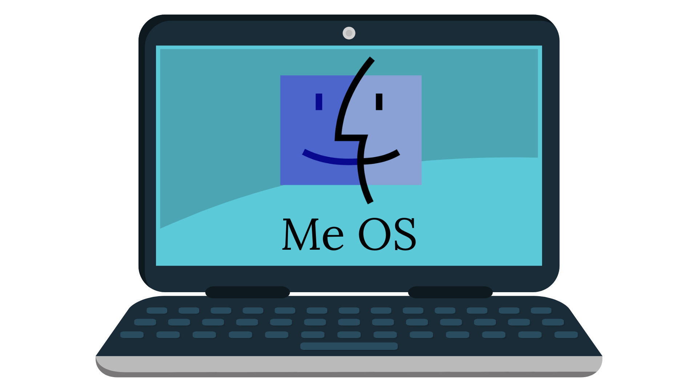

<figure markdown="span">

  <figcaption>Courtesy of my mad Canva skills</figcaption>
</figure>

## My Leadership Operating System

This is a living document of how I think about leadership — the mindset I carry, the actions I take, the habits I practice, and the decisions I make. It’s not static. I’ll keep refining it as I grow.

<!-- more -->

---

## Mindset
Mindset is the foundation of how I approach leadership and life. It reflects what I believe about people, progress, and the role I play in shaping outcomes. These beliefs anchor my leadership and influence how I show up for others.  

- I care deeply about being a good teammate, partner, friend and companion  
- I’m happiest when I’m building stuff  
- I believe the sum of a group can be greater than the value of one  
- Apathy is my biggest turn off  
- I appreciate a hard earned win and often find gratitude in pain  
- I don’t expect fairness from life or the opportunities life provides  
- I believe people can create their own luck, my favorite kind of luck comes from hustling (movement)  
- I don’t believe I’d be where I’m at without others - it takes a village  
- I like to challenge the default - what got us here won’t get us there  
- There’s few places where people are moved physically and emotionally (concerts, weddings, etc). I strive to be a leader that evokes this phenomenon  
- I’m *still* and _always_ learning.

---

## Actions
Actions are the outward expressions of my leadership. They are how my beliefs translate into tangible behavior that others can see, experience, and respond to.  

- I think most of the day about how I can help people through making for them  
- I search for human moments and rawness in the conversations I have  
- I treat feedback and people’s time as a gift  
- I telegraph my thought process, how delivery happens, and my direction 
- Life happens fast when you display a sense of urgency. 

---

## Habits
Habits are the rhythms and rituals I practice that reinforce my mindset and keep my actions consistent. They are how I sustain momentum and keep improving over time.  

- I constantly fall in love with the process of improvement and learning  
- I strive to build a rhythm to leading, working, and executing. I love to make things rehearse-able and practiced - it gets us close to perfect  
- My habits equate to how my operating systems runs in aggregate. 

---

## Decisions
Decisions are where leadership is tested. The way I make choices — quickly, with intention, and with room to pivot — reflects both my confidence and my humility in the face of uncertainty.  

- I put a lot of value into the speed of decision making, and more importantly creating opportunities to pivot - fail fast and learn faster  
- I don’t like redoing what’s been done. I’m motivated by new experiences and opportunities  
- I’m competitive and love being in the thick of exceptional people and experiences  

