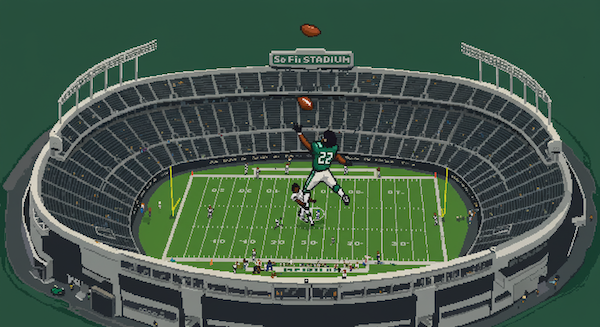

<figure markdown="span">

  <figcaption>Courtesy of Google Whisk AI</figcaption>
</figure>

## Building "NFL Player Picks": Merging Data, Strategy, and Tech to Help Athletes Make Smarter Choices

I’ve always been fascinated by the intersection of data, decision-making, and technology. Recently, two podcast episodes sparked an idea that I couldn’t shake — one that combines my passion for fantasy football, my love for tech, and my curiosity about how NFL players make decisions about their careers.

> To access the NFL Team Picker app, go [here](https://v0-nfl-team-selector-equcij.vercel.app/). 

<!-- more -->

### The Spark of an Idea

It started while listening to the Freakonomics podcast. Steven Dubner was talking about the NFL Players Association (NFLPA) and their [annual team report card](https://nflpa.com/nfl-player-team-report-cards-2024) — a survey where players grade their teams on various factors like facilities, staff, and travel. The conversation shifted to the idea that NFL players could, in theory, choose their teams rather than being drafted. While that might seem far-fetched in today’s NFL, the point about player decision-making really struck me.

The guest on the show explained that most players rely heavily on their agents for insights about teams, cities, and overall quality of life. Essentially, agents act as advisors, but the information they rely on — from city data to NFLPA surveys — is often public. That's when it hit me:

**Why not build a web app that helps players explore their ideal team and city fit based on real data?**

## Inspiration from Vercel and Next.js
The timing couldn’t have been better. Around the same time, I was listening to the Acquired podcast, which featured Guillermo Rauch, the founder of Vercel (v0) and creator of Next.js. Hearing about how Vercel leverages AI to enhance developer productivity got me excited to try their platform. I realized this "NFL Player Picks" idea would be the perfect opportunity to experiment with Vercel, Next.js, and React — all while building something meaningful.

> Listen to the podcast [here](https://www.acquired.fm/episodes/building-web-apps-with-just-english-and-ai-with-vercel-ceo-guillermo-rauch).

### The Vision for "NFL Player Picks"

I envision this app as a powerful yet simple tool. Players — or anyone curious about NFL team dynamics — could answer a few questions about their preferences, and the app would suggest ideal team/city combinations. The recommendations would consider factors like:

NFLPA Report Card Scores: Insights into team facilities, training staff, travel, etc.
City Data: Crime rates, housing costs, state income taxes, and lifestyle considerations.
Team Performance and Culture: Championship history, coaching stability, and player development.
By combining this data in a clean, interactive UI, I hope to create something that empowers players (and maybe even fantasy football managers) to make smarter decisions.

## Why This Matters

For NFL hopefuls, career decisions go far beyond performance on the field. A player's success — and happiness — can be deeply impacted by where they live, the resources they have, and the environment they’re stepping into. By making this data accessible in a clear and unbiased way, I believe NFL Player Picks can provide valuable insights that might otherwise go overlooked.

### What's Next?

With the NFL Draft approaching and dynasty fantasy football leagues heating up, I'm excited to launch this project [here](https://v0-nfl-team-selector-equcij.vercel.app/). While it started as a curiosity-driven idea, I see real potential in how data and AI-driven insights can empower players and fans alike.

I’ll be sharing my development journey — from learning Next.js to experimenting with Vercel’s AI-powered tools — and diving deeper into the data that makes this project tick. Stay tuned as I build NFL Player Picks and explore how tech can help players find their perfect team and city fit.

If you're a football fan, tech enthusiast, or just curious about data-driven decision-making, I’d love to hear your thoughts!

