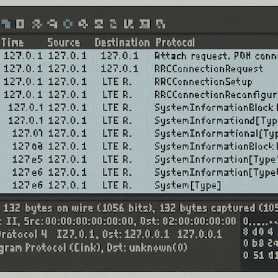

<figure markdown="span">

  <figcaption>Courtesy of ChatGPT</figcaption>
</figure>

## Background: Why I wanted to do this project

I still remember my first taste of wardriving. My dad and I took a trip down the 101 highway from WA to CA and we "stayed" (slept in the parking lot of) motels on the way. Back then, my dad carried an old laptop with him wherever he went. He showed me how to get through the admin gateways of their wifi portals to get internet for free so we could spend the evenings watching movies together. Those nights still live in my memory rent free, but they also gave me a lot of purpose when I took my first networking and pen testing classes. Learning formally how networks worked and how to test web apps made me realize how lucky I was to have such a creative dad. 

Fast forward to one of the startups I worked at, Rhino Security Labs, and I learned a lot about the owner/CEOs passion for network devices ([ProxyHam](https://www.wired.com/2015/07/online-anonymity-box-puts-mile-away-ip-address/)) and ended up going to my first security conferences and meetups. That's when I learned about IMSI catchers - network devices that capture cell traffic. I remember being warned not to carry my phone on me during these conferences and definitely not connecting to any networks. That is why when I saw [Chad Butler's LinkedIn post about Rayhunter](https://www.linkedin.com/posts/chaddbutler_meet-rayhunter-a-new-open-source-tool-from-activity-7304138561585393667-0ImT/), it ignited a passion I've had for a long time about privacy and understanding who could be watching what I'm looking at. 

!!! note
    ## Why This Matters  
    Mobile‑network surveillance tools — better known as [**IMSI‑catchers**](https://sls.eff.org/technologies/cell-site-simulators-imsi-catchers) or “Stingrays” — pretend to be legitimate cell towers so they can collect device identifiers or even downgrade encryption. They’re often deployed at protests, border crossings, and large public events, but ordinary users have almost no visibility when one is nearby. **Rayhunter** flips that script: with nothing more than a pocket‑sized hotspot, you can flag suspicious towers *in real time* and share your findings with the wider privacy community.

---

## What is Rayhunter?
Rayhunter is an **open‑source Rust application** released by the Electronic Frontier Foundation (EFF). 

Once flashed onto a supported hotspot (Orbit), it:

* Captures **3GPP signaling traffic only**—never user payloads.  
* Applies a library of heuristics that spot behaviors common to cell‑site simulators (for example, impermissible identity requests, null ciphering, abnormal tower power levels).  
* Logs events locally and surfaces a simple web UI at `localhost:8080`. It provides pcap captures so you can open your log files in Wireshark.  
* The Orbit flashes a **green** or **red** status bar on the device screen for at‑a‑glance awareness. 

While it's early in development ([download it here from GitHub](https://github.com/EFForg/rayhunter)), you can download it on your [Orbit device](https://www.amazon.com/Orbic-Verizon-Hotspot-Connect-Enabled/dp/B08N3CHC4Y) so you can monitor who could be monitoring _you_. 

<!-- more -->

## Who Should Try It & Real‑World Use‑Cases  

My use case: I wanted something small that I could carry with me on the go, so I could monitor the device I'm using. I often travel with my laptops and phone and findings myself using coffee shop or airport wifi. If the wifi I'm evaluating doesn't have some sort of secure authorization, I don't use it, and even when there is a login I make sure to make sure to get the info from a company agent so I'm not being spoofed at some level. Call me paranoid, but privacy is a big deal for me. I'm looking forward to Rayhunter being part of my travel equipment so I can test and verify while I'm on the go.  

#### Other Use Cases Include:
| Audience               | Scenario                | Payoff                                                                                                   |
|------------------------|-------------------------|-----------------------------------------------------------------------------------------------------------|
| Journalists / Activists| Protest or press event  | Real‑time alert if a Stingray is deployed nearby.                                                         |
| Human‑Rights NGOs      | Monitoring at borders   | Detect forced roaming to rogue towers in transit zones.                                                   |
| Academic Researchers   | Network‑security studies| Crowdsourced data set of anomalous cell‑tower behavior.                                                   |
| Privacy‑Minded Citizens| Everyday carry          | Peace of mind—and a concrete way to contribute to EFF’s mapping effort (opt‑in).                          |

## How Rayhunter Works (High‑Level Flow)  

1. **Packet Capture** – Listens to modem debug logs, streaming them into a local *pcap‑like* buffer. These can be opened up and analyzed in Wireshark. 
2. **Pattern Analysis** – Runs Rust routines that compare signaling messages against a rule set (for example, “Got an unencrypted `IDENTITY_REQUEST`? Flag it.”).  
3. **Event Scoring** – Assigns a confidence level; high scores trigger the **red bar** and an event in the web UI.  
4. **User Alert & Logging** – Logs persist on a micro‑SD (optional) and can be exported for community research. Logs can be sent to EFF for analysis. 

<figure markdown="span">

  <figcaption>Courtesy of ChatGPT</figcaption>
</figure>

## Want to try Rayhunter? Or learn more?

I'll drop some links below! These are the resources I used to read up on it after I saw it on LinkedIn. It's a great mini=project and I'll definitely be travelling with it from now on! 

* GitHub – Rayhunter
https://github.com/EFForg/rayhunter
* EFF Launch Blog Post – “Meet Rayhunter: A New Open Source Tool to Detect Cellular Spying”
https://www.eff.org/deeplinks/2025/03/meet-rayhunter-new-open-source-tool-eff-detect-cellular-spying
* BleepingComputer Explainer – “Open‑source tool ‘Rayhunter’ helps users detect Stingray attacks”
https://www.bleepingcomputer.com/news/security/open-source-tool-rayhunter-helps-users-detect-stingray-attacks/
* Step‑by‑Step Setup Walk‑Through (Funnymonkey)
https://www.funnymonkey.com/2025/03/setting-up-rayhunter-from-eff-and-using-rayhunter-in-the-world/
* It’s FOSS News – “EFF’s Rayhunter Is Here To Catch Eavesdroppers”
https://news.itsfoss.com/eff-rayhunter/

