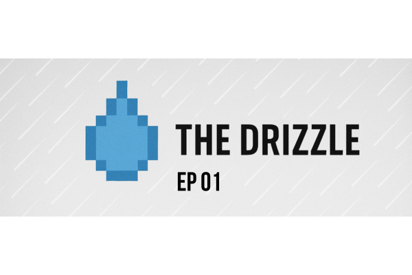

<figure markdown="span">

  <figcaption>Courtesy of my mad Canva skills + ChatGPT</figcaption>
</figure>

!!! abstract "The Drizzle: ep 01 - Trials of SDD, PRDs, and Product Engineering"
    ### Forecast: 

    A light drizzle of spec-driven development (SDD) with spec-kit, [GitHub's Specify project](https://github.com/github/spec-kit), and how my most recent project has me seeing SDD, and PRDs as a product leader and manager. 

    **GitLab Project:** [AI Fluency for Teams](https://gitlab.com/kylifornication/AI-Fluency-For-Teams)
    
    ### What is the Drizzle? 

    When your're in the PNW, you'll hear about a couple things often, the mountain being out and constant drizzle of rain we get hit with. This blog is a light dump every couple of weeks of some thoughts, articles, and projects I'm working on - a light drizzle of content that's on my mind. 

<!-- more -->

## Summary 

Background on the last couple weeks and what I've been wanting to build

!!! example "Watch the Demo"

    <iframe width="560" height="315" src="https://www.youtube.com/embed/vREoUiqUNbg?si=-4KLBHJCPdU9eSR-" title="YouTube video player" frameborder="0" allow="accelerometer; autoplay; clipboard-write; encrypted-media; gyroscope; picture-in-picture; web-share" referrerpolicy="strict-origin-when-cross-origin" allowfullscreen></iframe>

### Building your teams AI Fluency

Mine and my teams goal, where I got it from

## Your job/role is dead because of AI

LinkedIn Hype, get with the times

## Drizzle of Interesting Links

