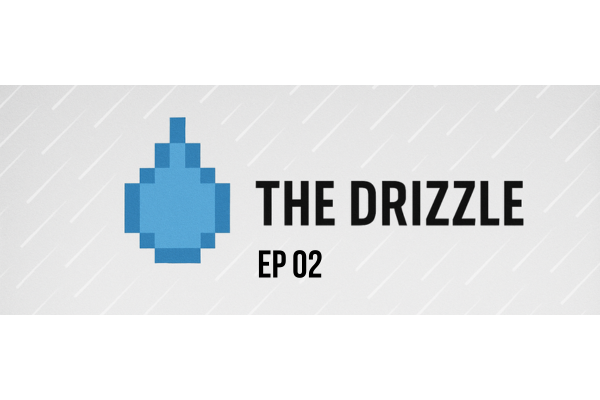

<figure markdown="span">

  <figcaption>Courtesy of my mad Canva skills + ChatGPT</figcaption>
</figure>

!!! abstract "The Drizzle: ep 02 - 20k days left, experiments and learning from them, and brand building"
    ### 🗓️ Short Forecast

    A heavy down pour of life, learning, experimenting, and looking ahead. The last couple week's I've spent reflecting, finding gratitude, and trying to project **what are the bets I'm going to be making** in the next year.  

    **This week's project:** [Using Kiro AI to build a POC of a learning request platform for my team](#)

<!-- more -->

## 💦 Previous 14-day Forecast

- **20-25k days left to live:** First off, this isn't an existential post that I want to remember or others to remember as heavy. I have a privileged life, but I did just have a birthday and that's why I found [this post by Yew Jim about having 10k days left](https://yewjin.substack.com/p/note-to-my-present-self?r=ewzt3&utm_campaign=post&utm_medium=web&triedRedirect=true) so interesting. He says, "Time is only _real_ currency", and I couldn't agree more. I'm in my mid 30s and to realize that at best I have 25k days left (to reach 100 yrs old), or 20k to reach 90 yrs old, isn't a crisis, but it's a fact in the game of life. Sahil Bloom talks about something similar that I reflect on as well (tagged below)
- **More Spec-Driven Dev w/ Kiro:**
- **Personal and Profession Branding:**
- **Tech Interviewing:** 

### Making Bets 

#### How are you going to treat your next days? 

<blockquote class="twitter-tweet">
95%  By the time your child turns 18, you&#39;ve spent ~95% of the time you will ever spend with them in your lifetime.  There are specific windows—­much shorter than you care to imagine or admit—during which certain people and relationships will occupy your life.  You may have only… <a href="https://t.co/1BbKxp6jCA">pic.twitter.com/1BbKxp6jCA</a>
&mdash; Sahil Bloom (@SahilBloom) <a href="https://twitter.com/SahilBloom/status/1888235470758514699?ref_src=twsrc%5Etfw">February 8, 2025</a></blockquote> 

### My review of Kiro AI 

!!! example "Watch the Demo"

    <iframe width="560" height="315" src="https://www.youtube.com/embed/vREoUiqUNbg?si=-4KLBHJCPdU9eSR-" title="YouTube video player" frameborder="0" allow="accelerometer; autoplay; clipboard-write; encrypted-media; gyroscope; picture-in-picture; web-share" referrerpolicy="strict-origin-when-cross-origin" allowfullscreen></iframe>

## 🖇️ Digital Drizzle: Interesting Links/Stories

- TBD

------

**Like what I do and want to support me?** 
 [☕ Buy me a Coffee](https://buymeacoffee.com/kylifornication){ .md-button .md-button--primary .md-button--coffee target="_blank" rel="noopener"}

------