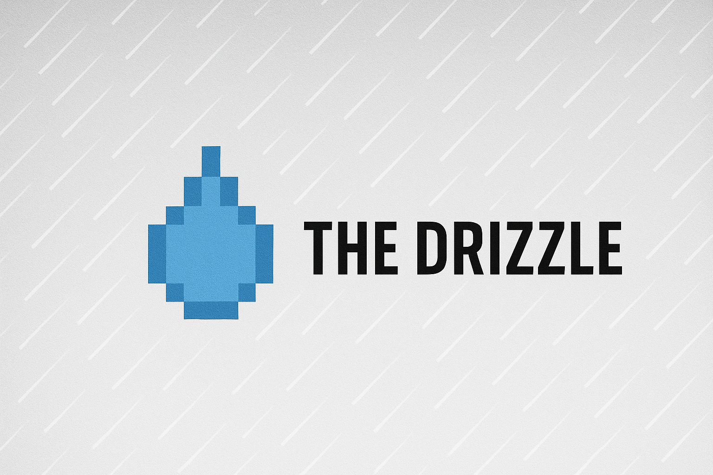

---
hide:
  - toc
  - navigation
---

  <!-- Hero Section -->
  <section class="hero-section">
    

      

        <h1 class="hero-title">Welcome to The Drizzle</h1>
        
Personal Stories from the PNW

        
I'm KJ, a passionate technologist that loves building stuff. This is my digital space where I share my operating system — how I think and work.

        

          <a href="aboutme" class="btn btn-primary">About Me</a>
          <a href="projects" class="btn btn-secondary">My Projects</a>
        

      

      

        
      

    

  </section>

  <!-- About Section -->
  <section class="about-section">
    

      <h2>What I Do</h2>
      

        

          
🚀

          <h3>Product & Engineering</h3>
          
I've worked in Product, Engineering, and Security. I'm at my happiest when I'm building things and solving complex problems.

        

        

          
🖨️

          <h3>3D Printing & Innovation</h3>
          
You'll find me constantly 3D printing and writing into my phone, scribbling down thoughts and ideas for the next big thing.

        

        

          
👨‍👩‍👧‍👦

          <h3>Family First</h3>
          
I'm a dad, husband, brother, and my family is important to me. They're the foundation of everything I do.

        

      

    

  </section>

  <!-- Blog Preview Section -->
  <section class="blog-section">
    

      <h2>Latest Thoughts</h2>
      
This site serves as a portfolio of my work, showcasing my current projects and providing a platform for my thoughts and ideas.

      

        <a href="blog" class="btn btn-outline">Read My Blog</a>
        <a href="projects" class="btn btn-outline">View Projects</a>
      

    

  </section>

  <!-- Contact Section -->
  <section class="contact-section">
    

      <h2>Let's Connect</h2>
      
Have a project in mind or just want to chat? I'd love to hear from you!

      

        

          
        

      

    

  </section>

